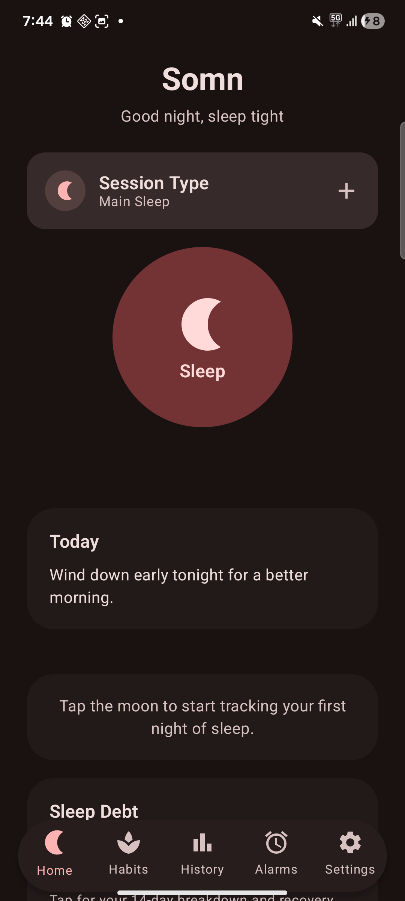
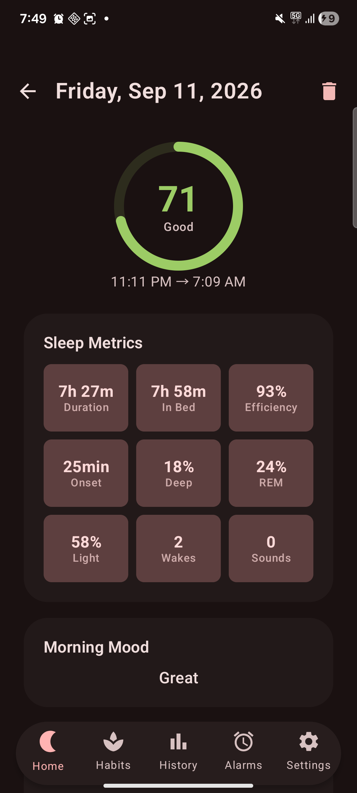
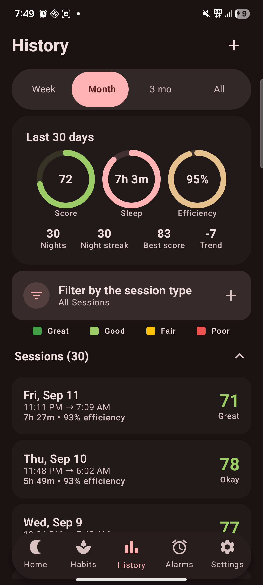
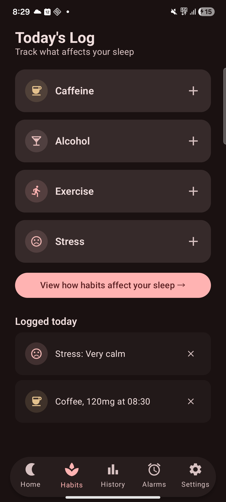
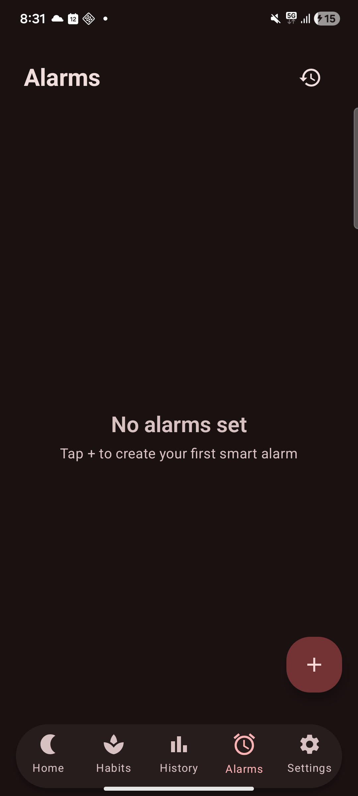
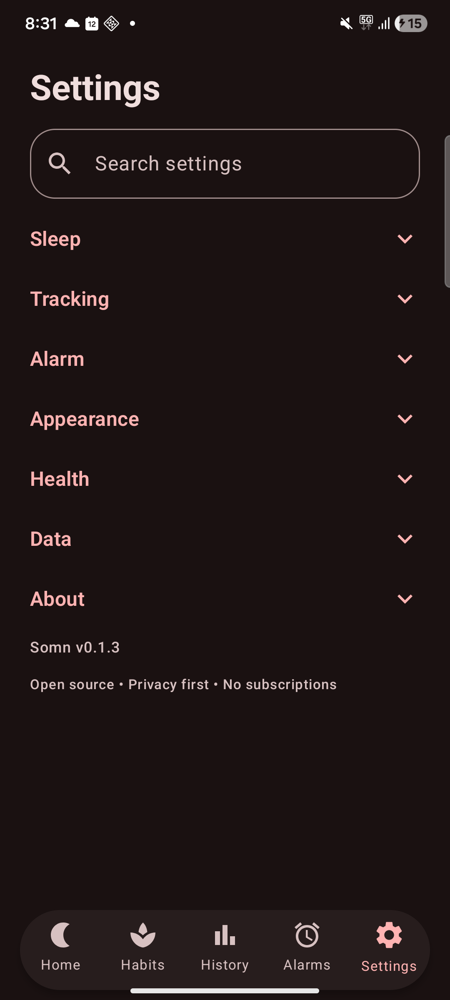

<p align="center">
  
</p>

<h1 align="center">Somn</h1>

<p align="center">
  <strong>A privacy-first, open-source sleep tracker for Android.</strong>
</p>

<p align="center">
  <a href="https://github.com/Vic-41148/somn/actions/workflows/ci.yml"></a>
  <a href="LICENSE"></a>
  <a href="https://github.com/Vic-41148/somn/releases"></a>
  <a href="https://github.com/Vic-41148/somn/releases"></a>
  <a href="https://github.com/Vic-41148/somn"></a>
</p>

> *"somn"* — from Latin *somnus*, meaning sleep.

Somn uses the built-in accelerometer to track sleep stages overnight. You do not need a
wearable. It scores sleep with age-calibrated algorithms, adjusts for your biological
profile, and keeps every byte of data on your device.

---

## Screenshots

<p align="center">
  
  
  
  
  
  
</p>

<!-- Same files double as the F-Droid store listing (see phoneScreenshots/README.txt). -->

---

## Download

[](https://github.com/Vic-41148/somn/releases)
<!-- TODO: Obtainium badge once the app is submitted there. -->
<!-- TODO: F-Droid badge once published (issue #8). -->

Get the latest APK from the
[releases page](https://github.com/Vic-41148/somn/releases) and open it on your device
(Android 8.0 / API 26+). Allow "install unknown apps" when asked.

> **Do not install v0.1.0.** It is deprecated and its release was removed. Tapping the
> Sleep button (and in some cases Settings) can close the app on Android 14+. Use v0.1.3
> or newer instead.

<details>
<summary>Verify your download</summary>

Every release ships `SHA256SUMS.txt`, a CycloneDX SBOM (`somn-bom.json`), and a
Sigstore bundle (`SHA256SUMS.txt.cosign.bundle`):

```
sha256sum -c SHA256SUMS.txt
cosign verify-blob --bundle SHA256SUMS.txt.cosign.bundle \
  --certificate-identity-regexp 'https://github.com/Vic-41148/somn/.github/workflows/release.yml@.*' \
  --certificate-oidc-issuer https://token.actions.githubusercontent.com \
  SHA256SUMS.txt
```

</details>

---

## Features

**Track & understand**

- **Overnight sleep tracking** — phone-on-bed accelerometer analysis in 30-second epochs. No wearable needed
- **Sleep stages** — Wake, Light, Deep and REM from movement magnitude & variability
- **Smart scoring** — weighted, age-calibrated, and aware of your biological profile (cycle phase, pregnancy, ADHD leniency)
- **History & hypnogram** — session list, detailed breakdowns, retroactive creation and editing
- **Morning review** — score ring plus stage breakdown after every night
- **Habits, debt & rhythm** — caffeine/alcohol/exercise/stress correlations, running sleep debt with recovery guidance, chronotype and social-jet-lag analysis

**Wake up & wind down**

- **Smart alarm** — gradual volume increase inside a configurable wake window
- **Wind-down exercises** — breathing routines, cognitive shuffle, ADHD cooldown — plus a gentle anti-snore vibration nudge

**Open & private**

- **Audio monitoring** — snore, cough and sleep-talk detection with optional on-device YAMNet classification and breathing-rate estimation
- **Health Connect** — optional and off by default. Reads vitals from your other apps, writes Somn sessions back
- **Take your data with you** — CSV & JSON export, Sleep-as-Android import, encrypted NAS backup to your own server

The complete inventory lives in [FEATURES.md](FEATURES.md).

---

## Privacy

- **No analytics, no crash reporting, no ads, no account** — Somn uploads nothing unless you explicitly set up NAS backup
- **Everything stays on-device** — Room database, excluded from Google Auto Backup; recordings auto-expire after 7 days
- **Zero Google Play Services** in the release build; a single module declares `INTERNET`, for NAS backup only

Full details — every stored field, every permission, how to delete anything — are in
[PRIVACY.md](PRIVACY.md).

---

## Architecture

A multi-module Android app that follows clean architecture and unidirectional data flow.

```
app/                    → Application entry point, navigation, DI
core/
  ├── data/             → Room database, DAOs, entities, repositories, NAS backup, retention
  ├── domain/           → Models, use cases (pure Kotlin)
  ├── audio/            → Mic/sonar collectors, audio-event classification, breathing rate
  ├── health/           → Health Connect integration
  ├── notifications/    → Notification builders, weekly report worker
  └── ui/               → Design system, theme, shared composables
feature/
  ├── tracking/         → Sleep tracking service, accelerometer, home screen
  ├── alarm/            → Smart alarm system, receivers, firing UI
  ├── analytics/        → History, session detail, charts
  ├── habits/           → Habit logging, correlation & sleep-debt insights
  ├── winddown/         → Pre-sleep breathing and cognitive exercises
  ├── onboarding/       → Multi-step profile setup flow
  └── settings/         → App preferences
```

---

## Tech Stack

| Layer | Tech |
|---|---|
| Language | Kotlin |
| UI | Jetpack Compose + Material 3 |
| Navigation | Compose Navigation |
| DI | Hilt |
| Database | Room |
| Async | Kotlin Coroutines + Flow |
| Build | Gradle (Kotlin DSL) + Version Catalog |
| Min SDK | 26 (Android 8.0) |
| Target SDK | 35 |
| AGP | 9.1.0 |

---

## Build & Run

Prerequisites: **JDK 17**, **Android Studio** Meerkat or later (or Android SDK with build
tools 35), a device or emulator on **API 26+**.

```bash
git clone https://github.com/Vic-41148/somn.git
cd somn
./gradlew assembleStandaloneDebug
```

The APK lands at `app/build/outputs/apk/standalone/debug/app-standalone-debug.apk`.
Build flavors, the JDK-path override, tests, lint and demo-data seeding are all covered
in [CONTRIBUTING.md](CONTRIBUTING.md). The full suite (# 310 unit tests) must stay green —
CI enforces the count quoted here and there.

---

## Contributing

Contributions are welcome. This is an early-stage project — see the
[open issues](https://github.com/Vic-41148/somn/issues) for what is next.

Read [**CONTRIBUTING.md**](CONTRIBUTING.md) first. It covers how to build the project, how
to open a pull request against `dev`, which CI checks must pass, and the coding and privacy
conventions of the project.

Quick start:

1. Fork the repo
2. Create a feature branch (`git checkout -b feature/my-feature`)
3. Commit your changes
4. Push and open a PR against `dev`

---

## License

The GNU General Public License v3.0 covers this project. See [LICENSE](LICENSE).

---

<p align="center">
  <sub>Built by <a href="https://github.com/Vic-41148">Vic-41148</a></sub>
</p>
